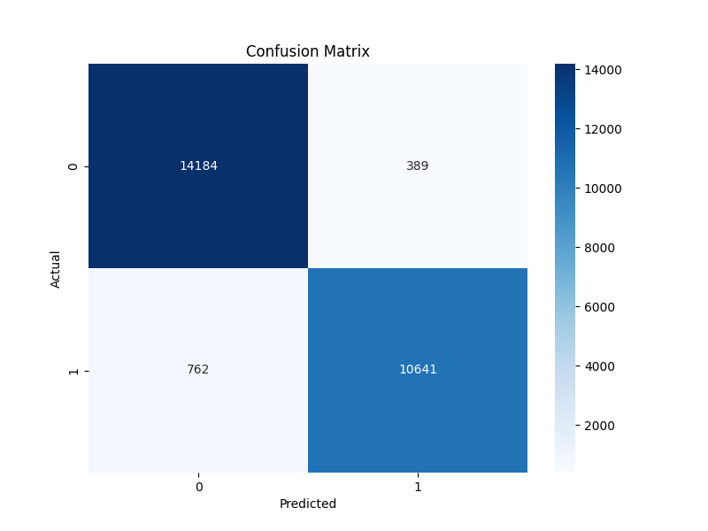
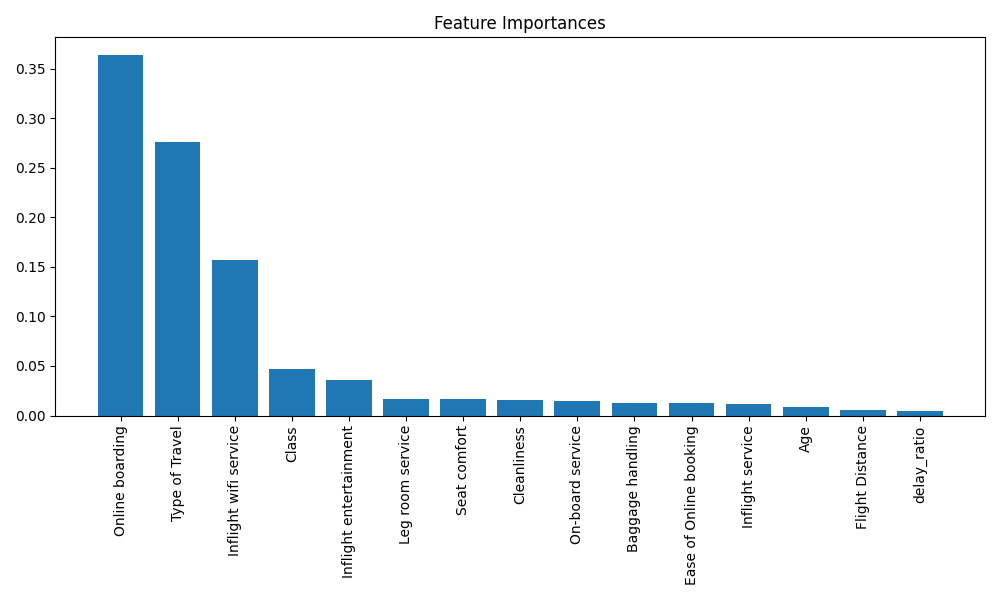

# SatisFlight: Airlines Customer Satisfaction Intelligence 🛫

## Overview 📊
This project implements a machine learning solution to predict airline customer satisfaction using XGBoost. Our model achieves exceptional accuracy in predicting whether customers will be satisfied with their flight experience based on various service metrics.

## Project Highlights 🌟
- **Outstanding Performance**: 95.57% accuracy in predicting customer satisfaction
- **MLflow Integration**: Experiment tracking with DagsHub
- **DVC Pipeline**: Reproducible machine learning workflow
- **Feature Analysis**: Deep insights into factors affecting satisfaction

## Model Performance 📈

| Metric    | Score  |
|-----------|--------|
| Accuracy  | 95.57% |
| Precision | 96.47% |
| Recall    | 93.32% |
| F1 Score  | 94.87% |

### Confusion Matrix Visualization


- True Negatives: 14,184
- False Positives: 389
- False Negatives: 762
- True Positives: 10,641

### Feature Importance Analysis


Key influential factors in customer satisfaction:
1. Online boarding
2. Type of Travel
3. Wifi service
4. Class
5. Inflight entertainment

## Tech Stack 🛠️

### Core Technologies
- Python 3.12
- XGBoost
- MLflow
- DVC (Data Version Control)
- scikit-learn

### Development Tools
- GitHub Actions (CI/CD)
- DagsHub (MLOps Platform)
- Visual Studio Code

## Project Structure 📁
```
├── data/                  # Data directory
│   ├── featured/         # Feature engineered data
│   ├── processed/        # Cleaned data
│   └── raw/             # Original dataset
├── models/               # Trained models
├── reports/             # Performance reports
│   └── figures/         # Visualizations
├── src/                 # Source code
│   ├── data_collection.py
│   ├── data_preprocessing.py
│   ├── feature_engineering.py
│   ├── model_buiding.py
│   └── evaluate_model.py
└── config files (dvc.yaml, params.yaml)
    │
    ├── docs               <- A default Sphinx project; see sphinx-doc.org for details
    │
    ├── models             <- Trained and serialized models, model predictions, or model summaries
    │
    ├── notebooks          <- Jupyter notebooks. Naming convention is a number (for ordering),
    │                         the creator's initials, and a short `-` delimited description, e.g.
    │                         `1.0-jqp-initial-data-exploration`.
    │
    ├── references         <- Data dictionaries, manuals, and all other explanatory materials.
    │
    ├── reports            <- Generated analysis as HTML, PDF, LaTeX, etc.
    │   └── figures        <- Generated graphics and figures to be used in reporting
    │
    ├── requirements.txt   <- The requirements file for reproducing the analysis environment, e.g.
    │                         generated with `pip freeze > requirements.txt`
    │
    ├── setup.py           <- makes project pip installable (pip install -e .) so src can be imported
    ├── src                <- Source code for use in this project.
    │   ├── __init__.py    <- Makes src a Python module
    │   │
    │   ├── data           <- Scripts to download or generate data
    │   │   └── make_dataset.py
    │   │
    │   ├── features       <- Scripts to turn raw data into features for modeling
    │   │   └── build_features.py
    │   │
    │   ├── models         <- Scripts to train models and then use trained models to make
    │   │   │                 predictions
    │   │   ├── predict_model.py
    │   │   └── train_model.py
    │   │
    │   └── visualization  <- Scripts to create exploratory and results oriented visualizations
    │       └── visualize.py
## Pipeline Stages 🔄

1. **Data Collection**: Initial dataset acquisition
2. **Preprocessing**: Data cleaning and preparation
3. **Feature Engineering**: Feature selection and transformation
4. **Model Building**: XGBoost classifier training
5. **Evaluation**: Performance metrics and model interpretation
```
## Getting Started 🚀

### Prerequisites
- Python 3.12
- pip package manager

### Installation
1. Clone the repository:
   ```bash
   git clone https://github.com/Sudip-8345/SatisFlight-Customer-Satisfaction-Intelligence.git
   cd SatisFlight-Customer-Satisfaction-Intelligence
   ```

2. Create and activate virtual environment:
   ```bash
   python -m venv myenv
   myenv\Scripts\activate  # Windows
   ```

3. Install dependencies:
   ```bash
   pip install -r requirements.txt
   ```

### Running the Pipeline
```bash
dvc repro
```

## MLOps Integration 🔗

### MLflow Tracking
- Experiment tracking (Run ID: fe9dbf08d7414d088c10c1e70bac05ad)
- Model versioning
- Performance monitoring

### DVC Pipeline
- Data versioning
- Pipeline reproducibility
- Automated workflow

### GitHub Actions
- Automated testing
- CI/CD pipeline
- Model evaluation

## License 📜
This project is licensed under the MIT License - see the [LICENSE](LICENSE) file for details.

## Author ✍️
**Sudip Das**

## Acknowledgments 🙏
- Project structure based on the [cookiecutter data science](https://drivendata.github.io/cookiecutter-data-science/) project template
